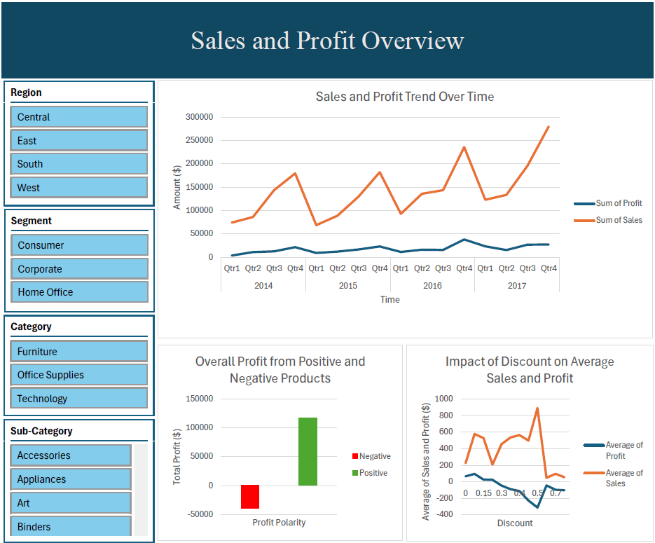
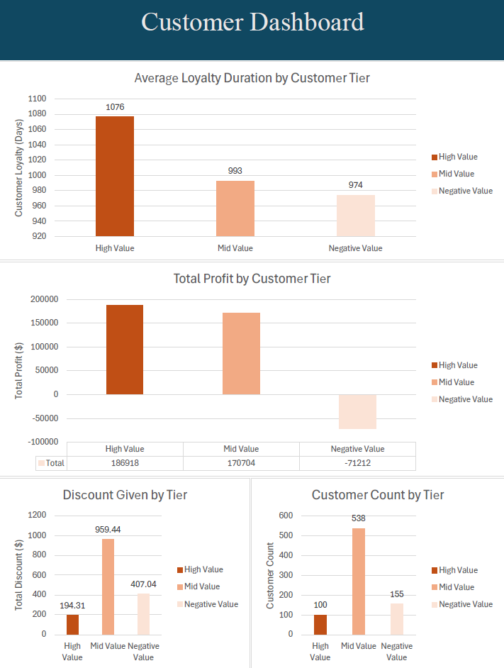

# Superstore Sales and Customer Analysis

  
*Overview of sales trends, discounts, and product performance*

  
*Customer segmentation and loyalty insights*

## Objective
This project analyzes sales, profit, and customer behavior using the Superstore dataset. The goal is to extract business insights, identify key performance patterns, and support data-driven decisions through Excel-based dashboards.

## Dashboard Features
- Interactive filters: Region, Segment, Category
- Time-based trends in **sales** and **profit**
- Segmentation of **positive vs. negative profits**
- Discount impact on **sales** and **profit**
- Customer tiering by **profit contribution**
- Metrics on **customer loyalty** and **purchase patterns**

## Business Questions Answered
- What are the sales and profit trends across time?
- Which product categories and segments are most or least profitable?
- Do discounts improve average sales or profit?
- How do top customers differ in loyalty, quantity, or discount usage?

## Key Insights
- **Sales trend upward overall**, but drop significantly each year in **Quarter 1**, suggesting a seasonal pattern
- The **Technology** category is the most profitable; **Furniture** underperforms
- **Heavy discounting** does not lead to better sales 
- **East and West** regions outperform others in sales and net profit
- High-value customers contribute the majority of net profit, but their average loyalty duration is **not significantly longer**, pointing to potential churn risks

## Recommendations
- Investigate causes of **Q1 seasonal decline** each year
- Review and possibly phase out **loss-making products**
- Define and apply an **optimal discount strategy** using past data
- Focus on retaining **high-value customers** with loyalty programs or incentives
- Expand strategies in top-performing regions; improve outreach in Central and South

## File Contents
- `Superstore_Overview_Dashboard.png`: Overview dashboard image
- `Superstore_Customer_Dashboard.png`: Customer-focused dashboard image
- `README.md`: Project summary and insights

## Tools Used
- Microsoft Excel (Data cleaning, pivot tables, and dashboard design)

## Data Source
Superstore dataset from Kaggle: [Superstore Dataset](https://www.kaggle.com/datasets/vivek468/superstore-dataset-final)

---

> Created as part of a hands-on data analytics project. For feedback or questions, feel free to connect!

